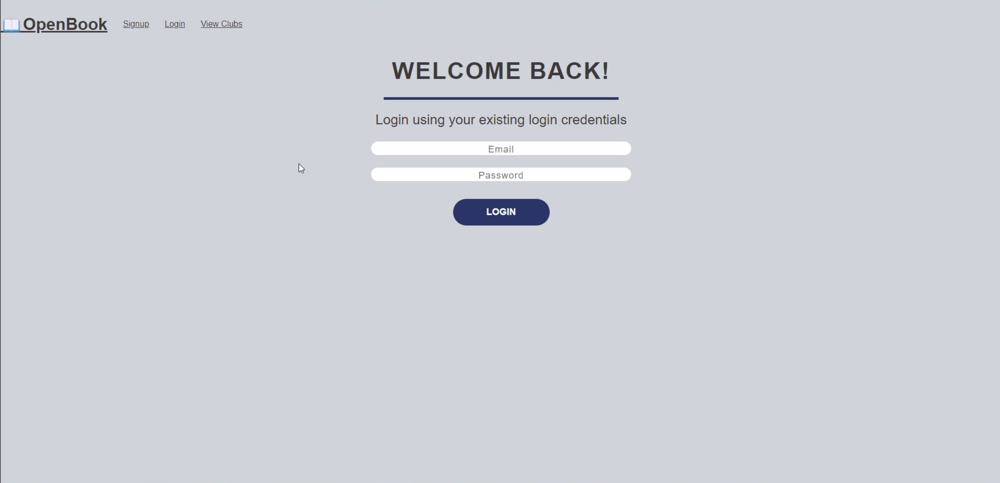

# OPEN BOOK Description

OpenBook is an online book club platform that allows users to join and interact with other users in book specific clubs. In addition, users will be able to purchase the book(s) directly through the specific club.

Application uses React for the front end.

Application has a GraphQL API with a Node.js and Express.js server, and uses queries and mutations for retrieving, adding, updating, and deleting data.

Application uses MongoDB and the Mongoose ODM for the database and protects sensitive API key information on the server.

Application includes user authentication using JWT.

# OPEN BOOK Screenshot

# Link

